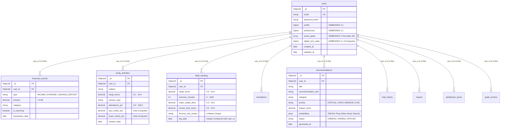

# Digital Twin AI — Database Architecture & ER Diagrams

This document illustrates the MongoDB Atlas NoSQL collection topology, embedding vs. referencing boundaries, and data flow architecture.

---

## Complete Mermaid ER Data Model

